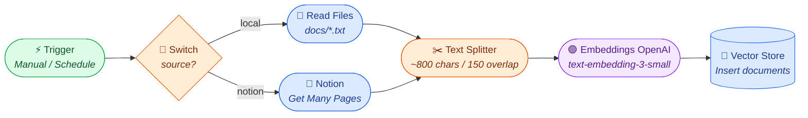

# RAG Flow — n8n Style

The same RAG pipeline drawn as **n8n-style node graphs**: a trigger node followed
by connected action nodes, left-to-right. As in n8n, it's split into two
workflows — one to **ingest/index** documents, one to **answer questions** — and
each node is mapped to the real n8n node you'd use to build it.

Diagrams use [Mermaid](https://mermaid.js.org/) (rendered inline on GitHub).
Node colors mimic n8n: 🟢 trigger · 🟣 AI/LLM · 🔵 data · 🟠 logic/branch.

---

## Workflow 1 — Ingestion (build the index)

Run on demand (or on a schedule) to load documents and push their embeddings into
the vector store. In this project this is `build_index()`.



---

## Workflow 2 — Chat / Query (answer a question)

Triggered by an incoming chat message. Mirrors `rewrite_query` → `retrieve` →
threshold check → `generate_answer`.

```mermaid
flowchart LR
    CT(["⚡ Chat Trigger<br/><i>On message</i>"]) --> MEM[("🔵 Chat Memory<br/><i>conversation history</i>")]
    MEM --> RW(["🟣 OpenAI Chat<br/><i>Rewrite to standalone query</i>"])
    RW --> QE(["🟣 Embeddings OpenAI<br/><i>embed query</i>")]
    QE --> RET[("🔵 Vector Store Retriever<br/><i>top-k cosine</i>")]
    RET --> IF{"🔀 IF<br/><i>any score ≥ 0.20?</i>"}
    IF -->|no| FB(["🟠 Set<br/><i>'I don't have that info'</i>"])
    IF -->|yes| QA(["🟣 Q&A Chain (OpenAI Chat)<br/><i>answer from context + cite</i>"])
    QA --> RESP(["💬 Respond to Chat"])
    FB --> RESP

    classDef trig fill:#dcfce7,stroke:#16a34a,color:#14532d;
    classDef ai fill:#f3e8ff,stroke:#9333ea,color:#581c87;
    classDef data fill:#dbeafe,stroke:#2563eb,color:#1e3a8a;
    classDef logic fill:#ffedd5,stroke:#ea580c,color:#7c2d12;
    class CT trig; class RW,QE,QA ai; class MEM,RET data; class IF,FB logic; class RESP trig;
```

---

## Node mapping — this project ↔ n8n

| Step in flow | This project (code) | Equivalent n8n node |
|--------------|---------------------|---------------------|
| Trigger (index) | run `build_index()` | **Manual Trigger** / **Schedule Trigger** |
| Pick source | sidebar radio | **Switch** |
| Read local docs | `load_documents()` | **Read/Write Files from Disk** |
| Read Notion | `notion_loader.fetch_notion_documents()` | **Notion → Get Many (Database Page)** |
| Chunk | `chunk_text()` / `build_chunks()` | **Recursive Character Text Splitter** |
| Embed | `embed_texts()` | **Embeddings OpenAI** |
| Store vectors | `VectorStore` | **Simple Vector Store** (or Pinecone/Supabase) |
| Chat trigger | `st.chat_input` | **Chat Trigger** |
| Memory | `st.session_state.messages` | **Window Buffer Memory** |
| Rewrite follow-up | `rewrite_query()` | **OpenAI Chat Model** (in a small chain) |
| Retrieve | `VectorStore.retrieve()` | **Vector Store Retriever** |
| Threshold | `MIN_SIMILARITY` filter | **IF** node on the score |
| Generate | `generate_answer()` | **Question and Answer Chain** + **OpenAI Chat Model** |
| Respond | Streamlit renders answer | **Respond to Chat / Webhook** |

---

## Notes if you actually rebuild this in n8n

- n8n's **AI/LangChain nodes** (Embeddings OpenAI, Vector Store, Q&A Chain,
  OpenAI Chat Model) cover the whole pipeline natively — you wire them together
  on the canvas instead of writing the loop.
- The **relevance-threshold** behavior isn't built into the retriever node, so
  you'd add an **IF** node on the retrieved score (as drawn) to branch to a
  fallback "I don't know" message — matching this project's `MIN_SIMILARITY`.
- The **two-workflow split** (ingest vs. chat) is the standard n8n RAG pattern:
  index occasionally, query often — exactly why this project caches the index
  with `st.cache_resource` and only rebuilds on **Re-index**.
- For a persistent store across runs you'd swap the in-memory **Simple Vector
  Store** for **Pinecone / Supabase / Qdrant** — the n8n equivalent of adding the
  embedding cache we discussed.
