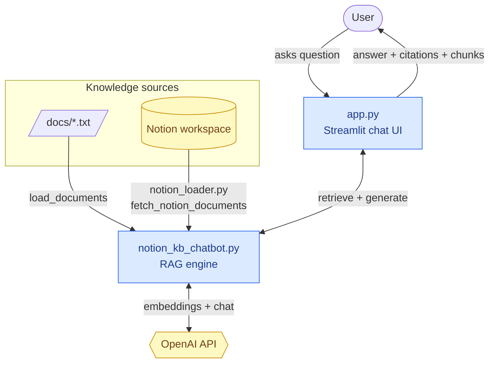
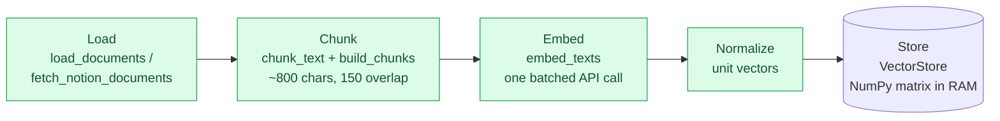
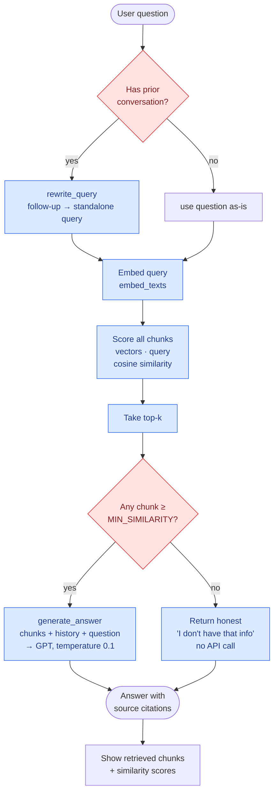
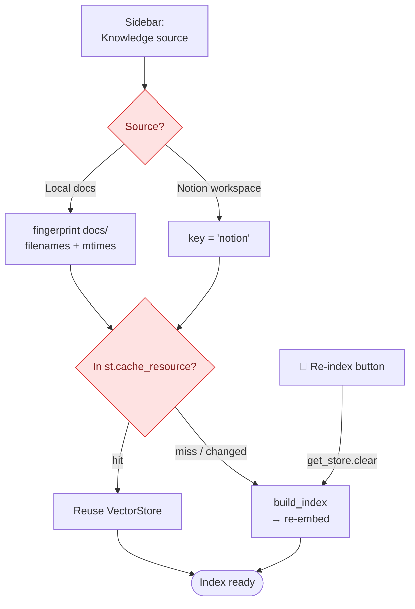
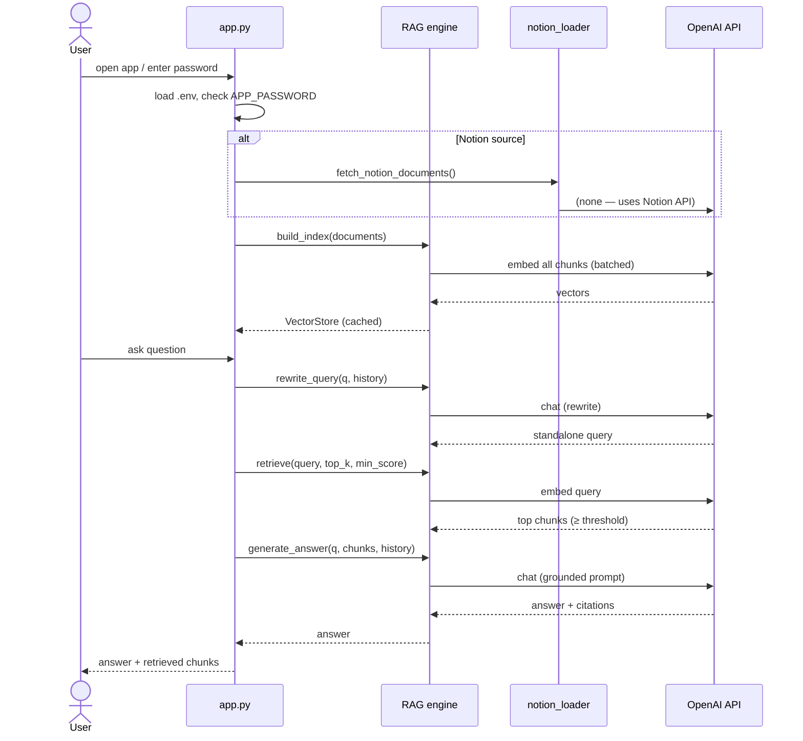

# System Architecture

A flowchart-based overview of the Notion KB Chatbot. Diagrams use
[Mermaid](https://mermaid.js.org/), which GitHub renders automatically.

---

## 1. High-level overview

How the pieces fit together: a Streamlit UI on top of a from-scratch RAG engine,
fed by either local files or a live Notion workspace, talking to the OpenAI API.

---

## 2. Indexing pipeline (build once)

Runs once per source and is cached (`st.cache_resource`), so documents are
embedded a single time and reused across every question.

Each chunk keeps its `source` (filename or Notion page title) so answers can
cite it.

---

## 3. Query → answer flow (per question)

The per-question path, including the two quality features: **query rewriting**
for multi-turn context and the **relevance threshold** that lets the bot say "I
don't know" honestly.

---

## 4. Source switching & caching

How the app decides what to index and when to rebuild.

The local-docs fingerprint means editing or adding a `.txt` auto-rebuilds the
index. Notion content can't be cheaply fingerprinted, so it's refreshed manually
via **Re-index**.

---

## 5. Request lifecycle (startup → first answer)

---

## Component reference

| Component | File | Responsibility |
|-----------|------|----------------|
| Web UI | `app.py` | Chat interface, password gate, source switch, index caching, displays citations & retrieved chunks |
| RAG engine | `notion_kb_chatbot.py` | Load, chunk, embed, store, retrieve, rewrite_query, generate_answer; also runs as a CLI |
| Notion source | `notion_loader.py` | Fetch pages via the Notion API and extract text |
| Knowledge base | `docs/*.txt` | Local source documents |
| Config | `.streamlit/config.toml` | Port 8502, headless |
| Secrets | `.env` | `OPENAI_API_KEY`, `NOTION_API_KEY`, `APP_PASSWORD` (gitignored) |

**Models:** embeddings `text-embedding-3-small`, generation `gpt-4o-mini`.
