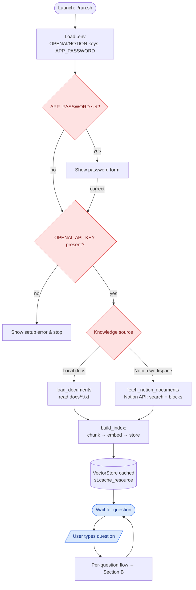
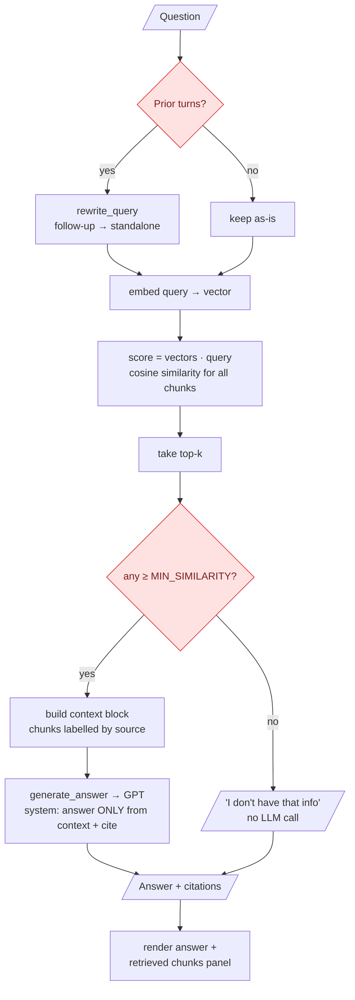
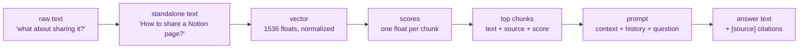

# System Flow

End-to-end runtime flow of the Notion KB Chatbot — what happens, in order, from
launch to a cited answer, and how a question's *data* is transformed at each
step. (For the structural/component view, see
[SYSTEM_ARCHITECTURE.md](SYSTEM_ARCHITECTURE.md).)

Diagrams use [Mermaid](https://mermaid.js.org/), which GitHub renders inline.

---

## A. Full end-to-end flow

---

## B. Per-question flow (the hot path)

---

## C. Data transformation

How one question's data changes shape as it flows through the pipeline:

| Stage | Shape | Produced by |
|-------|-------|-------------|
| Raw question | string | user |
| Standalone query | string | `rewrite_query` |
| Query vector | `(1536,)` float array | `embed_texts` |
| Similarity scores | `(num_chunks,)` array | `vectors @ query` |
| Retrieved chunks | list of `{source, text, score}` | `VectorStore.retrieve` |
| Prompt | messages list | `generate_answer` |
| Answer | string w/ citations | OpenAI chat |

---

## D. Numbered walkthrough

**Startup (once):**
1. `./run.sh` frees port 8502 and starts Streamlit.
2. `app.py` loads `.env`; if `APP_PASSWORD` is set, the password gate blocks until correct.
3. Verifies `OPENAI_API_KEY` exists, else shows a setup error and stops.
4. Reads the selected **Knowledge source** from the sidebar.
5. Loads documents — local `.txt` files, or live Notion pages via `notion_loader`.
6. `build_index` chunks the text (~800 chars, 150 overlap), embeds every chunk in
   one batched call, normalizes the vectors, and stores them in a `VectorStore`.
7. The store is cached (`st.cache_resource`) — steps 5–6 don't repeat unless the
   docs change or you press **🔄 Re-index**.

**Per question (every message):**
8. If there's prior conversation, `rewrite_query` turns the follow-up into a
   standalone search query; otherwise the question is used directly.
9. The query is embedded with the **same** model as the documents.
10. A single matrix-vector product scores every chunk by cosine similarity.
11. The top-k chunks are taken, then any below `MIN_SIMILARITY` are dropped.
12. **If nothing survives** → answer honestly ("I don't have that information"),
    skipping the LLM entirely.
13. **Otherwise** → the chunks form a labelled context block; `generate_answer`
    sends it (plus history and the question) to GPT with a grounded,
    citation-required system prompt at low temperature.
14. The answer renders with inline `[source]` citations and an expandable panel
    of the exact chunks retrieved and their similarity scores.

---

## E. Where to tune

| Want to change… | Knob | Where |
|-----------------|------|-------|
| More/less context per answer | `TOP_K` / sidebar slider | `notion_kb_chatbot.py` / app |
| Stricter "I don't know" | `MIN_SIMILARITY` / sidebar slider | `notion_kb_chatbot.py` / app |
| Chunk granularity | `CHUNK_SIZE`, `CHUNK_OVERLAP` | `notion_kb_chatbot.py` |
| Models | `EMBED_MODEL`, `CHAT_MODEL` | `notion_kb_chatbot.py` |
| Answer style/grounding rules | system prompt | `generate_answer` |
